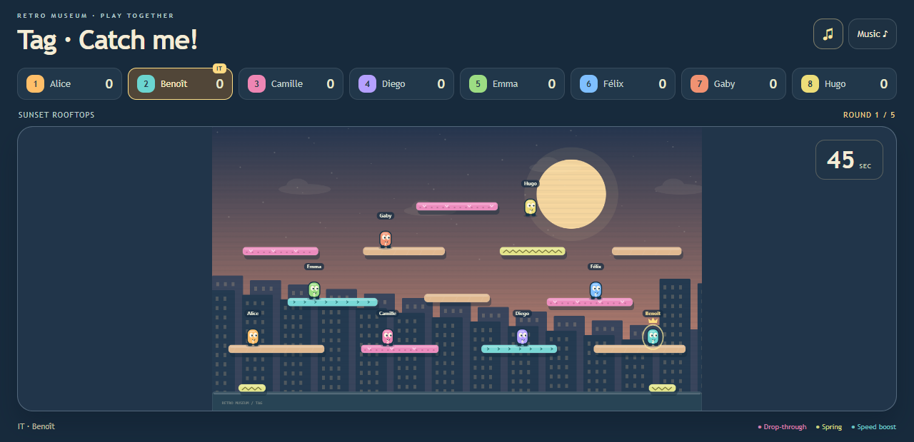
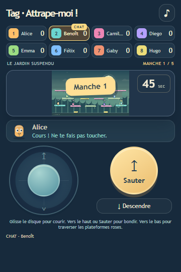
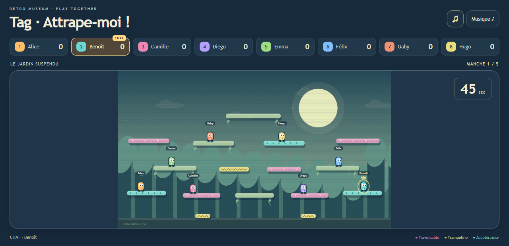
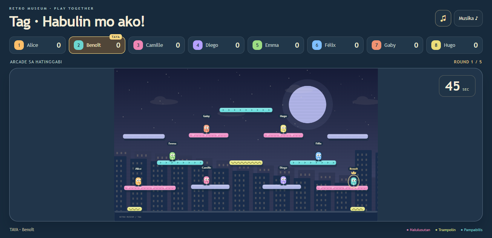

# Tag · Catch me!

A bright, friendly game of chase for **2–8 players**. One shared screen, a phone joystick for each runner, and one rule: **don't be “it” when the timer runs out!**

[Play online](https://play.retro-museum.net/g/tag) · [Retro Museum collection](https://retro-museum.net/#catalog)



## Play

Open the game on a shared screen. Each player scans its QR code, keeps their usual Retro Museum name/avatar, and receives a coloured runner. The organiser starts the match.

- Drag the **disc in the ring** to run left or right, like the Tanks controller.
- Push upward or press **Jump**. Release and jump again for a double jump, if enabled.
- Push downward or press **Drop through** to pass through pink platforms.
- Gold spring pads launch you upward; turquoise pads give a short speed boost.
- Touch another runner to pass on the tag. A short grace period prevents instant tag-backs.
- The tagged runner loses that round. Everyone else earns one point; nobody is eliminated between rounds. Most points wins, and equal scores share victory.



The organiser can choose **1, 3, 5 or 7 rounds**, **30, 45 or 60 seconds**, a fixed arena or rotation, and double jumps on/off. The three original arenas are **Sunset rooftops**, **The sky garden**, and **Midnight arcade**.

English, French and Tagalog are included. The host chooses the shared-screen language; players choose their phone language. Local-network/offline hosting, persistent joining QR codes, sharing, player profiles and combined display/controller mode are provided by Retro Museum, according to the organiser's settings.

Sound effects and original synthesized background music can be muted. Click the sound button on the shared screen to unlock audio if the browser requires a gesture. Reduced-motion preferences remove ambient animation and celebration particles. Keyboard alternatives: arrows/WASD, Space to jump, Down/S to drop through.

Arriving after the start makes you a spectator until replay. A disconnected player's controls expire within 300 ms; the timer continues. Phone **Play again** starts a fresh match with the connected roster, including waiting spectators, up to eight players.

## Other arenas




## Run locally

Requires Node.js 22 or newer.

```sh
npm ci --ignore-scripts
npm run build
npm start
```

Open the host URL printed in the terminal. Phones must be able to reach the host on the same network. The portable `dist/game.rmg.json` also installs through the Retro Museum game library once reviewed.

```sh
npm test
npx playwright install chromium
npm run test:browser
npx retro-museum-validate .
```

See [validation scope and limitations](docs/TESTING.md). GitHub Actions builds the package, runs engine/browser tests and the pinned official SDK prevalidation Action.

## Design and provenance

Inspired by the chase-and-platform rules described in [Joeriri's Tag on Construct](https://www.construct.net/en/free-online-games/tag-39/play). This is an independent implementation with original arenas, characters, Canvas/SVG artwork and synthesized music/sounds. No reference-game code, artwork, characters, maps or recordings are included. No external asset services, advertisements, analytics, purchases or tracking. Player names and avatars use the host's existing profile system.

MIT · Manaty
